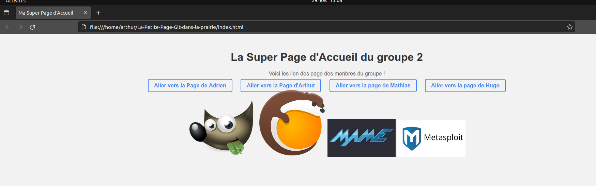

# Projet GIT
Voici le repositoire GIT, de notre projet de site pour notre cours de GIT


## Table des Matières

- [Projet GIT](#projet-git)
  - [Table des Matières](#table-des-matières)
  - [À Propos du Projet](#à-propos-du-projet)
  - [Index](#index)
  - [Fonctionnalités](#fonctionnalités)
  - [Structure du Site](#structure-du-site)
  - [Hook](#hook)

## À Propos du Projet

Il s'agit d'un site internet décrivant chacune des personne ayant travaillé sur ce projet.

## INDEX

Voici l'index de l'équipes



## Fonctionnalités

Il est possible d'aller de page en page des différentes personnes via le header. Il est aussi possible d'accéder aux LinkedIn des personnes ayant travaillé sur le projet.

## Structure du Site

Donnez une vue d'ensemble de la structure de votre site. Par exemple :

- **Index** : La page d'accueil du site.
- **Page 1** :
Découvrez GIMP, un logiciel de retouche d'images open source révolutionnaire. Gratuit, polyvalent et compatible avec diverses plates-formes, GIMP offre une alternative puissante aux solutions commerciales. Sa communauté active contribue à son évolution constante. Libérez votre créativité avec GIMP, téléchargeable gratuitement, et explorez un univers de retouche d'images accessible à tous. 
     
- **Page 2** :Je souhaite partager un projet open source fascinant : Lutris, un émulateur qui permet aux amateurs de jeux sur Linux, notamment ceux utilisant Ubuntu, de profiter de leurs titres préférés. L'objectif est d'offrir une expérience de jeu fluide sur cet OS, élargissant ainsi les possibilités de divertissement numérique sous Linux.
  
- **Page 3** :MAME, c'est bien plus qu'un émulateur de jeux d'arcade. En tant que passionné, je le vois comme une initiative incroyable pour préserver notre patrimoine vidéoludique. Il émule avec précision les jeux, mais aussi la technologie des machines, offrant une expérience authentique. Avec sa compatibilité étendue, il couvre des classiques des années 70 aux titres récents des années 2000. MAME n'est pas juste pour le fun, c'est aussi une ressource éducative qui documente l'histoire technique des jeux. Mais attention, pour rester légal, utilisez uniquement des ROMs de jeux que vous possédez légalement.
  
- **Page 4** :Metasploit, projet open source de renom, offre un cadre d'exploitation de tests de pénétration pour les professionnels de la sécurité. Grâce à une communauté active, il propose des outils puissants, des modules préconçus et une personnalisation avancée, simplifiant l'évaluation des systèmes informatiques. Cette plateforme modulaire, essentielle pour le développement et la validation des défenses numériques, incarne l'esprit collaboratif de la cybersécurité, favorisant la transparence et l'échange d'expertise pour renforcer la résilience numérique.
  


## Hook

Voici le hook dans le prepare-commit-message:
```
#!/bin/bash

team_number="2"  # Remplacez X par le numéro de votre équipe
team_members=("AdrienG" "ArthurG" "MathiasH" "HugoC")  # Remplacez Y par les noms des membres de votre équipe

generate_commit_message() {
    echo "Nous sommes l'équipe ${team_number}, composée de ${team_members[*]}"
}

# Utiliser la fonction pour générer le message de commit
commit_message=$(generate_commit_message)

# Écrire le message de commit dans le fichier
echo "$commit_message" > "$1"
```
